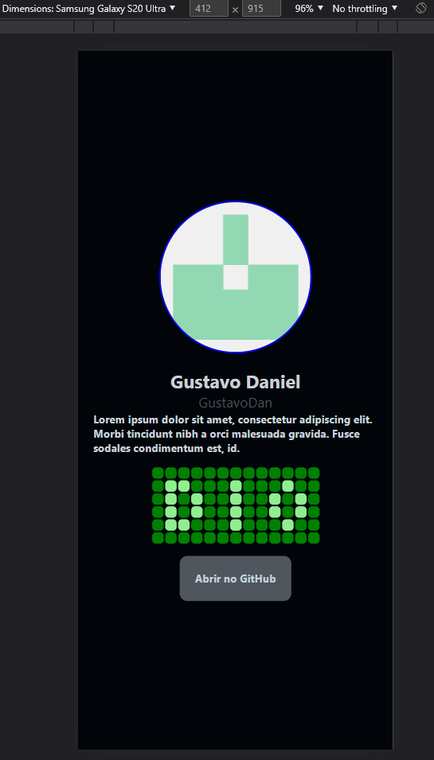

# DIO
## Introdução ao React Native

### Conteúdo
- Conhecendo o React Native
    - O que é react-native?
    - O que é cross-platform?
    - Origem do RN
- Documentação:
    - Componentes
    - API
    - Comunidade (Blog)
- Setup
    - Node
    - Expo
- Criação do projeto
    - Uso do Expo CLI
    - Estrutura de pasta
- Projeto Profile
    - View
    - Text
    - SafeAreaView
    - Image
    - Flex-box
    - StyleSheet
    - Pressable
    - Linking API
- Exercício
    - Fazer minhas próprias tags personalizadas e enviar suas propriedades para a função.
